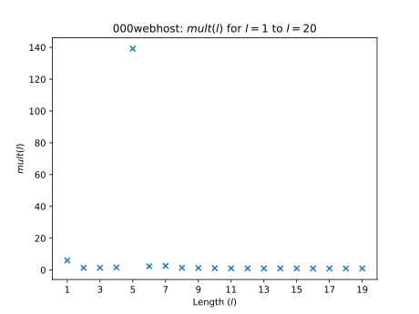

# pol-infer
Inferring password composition policies from breached user credential databases.


## Overview
Sometimes as security researchers we need to be able to work out the password composition policy that some publicly-available breached user credential database was created under. This tool is able to assist with this, even when the data is "contaminated" with passwords that do not comply with the policy.

## Prerequisites
This library requires you to have the following software installed:
* Python 3.7.2 or later \[[^](https://www.python.org/downloads/release/python-372/)\]
* Pandas for loading large CSV files \[[^](https://pandas.pydata.org/)\]
* Matplotlib for plotting figures \[[^](https://matplotlib.org/)\]

Both Pandas and Matplotlib can be installed using pip \[[^](https://pypi.org/project/pip/)\]:

```bash
pip install pandas
pip install matplotlib
```

## Usage
Using the utility is a two-step process. The first thing you'll need is a plaintext password database (try [SecLists](https://github.com/danielmiessler/SecLists) for these), which you'll need to format as a CSV file like so:

```
password, frequency
"123456", 290729
"12345", 79076
"123456789", 76789
"password", 59462
"iloveyou", 49952
"princess", 33291
"1234567", 21725
"rockyou", 20901
"12345678", 20553
...
```

Now, you'll be able to pass this file to `/src/extractfeatures.py` to generate a JSON file containing features of the database. For convenience, I've included some of these files under `/features` to save you doing this part yourself:

* `000webhost.json` is from [the 000webhost breach](https://www.zdnet.com/article/000webhost-hacked-13-million-customers-exposed/). This service apparently had a password composition policy in place mandating that passwords be at least length 6 with at least one letter and at least one number.
* `linkedin.json` is from [the LinkedIn breach](https://www.wired.co.uk/article/linkedin-data-breach-find-out-included). Reported password composition policy is length 6 with no other constraints.
* `rockyou.json` is from [the RockYou breach](https://techcrunch.com/2009/12/14/rockyou-hack-security-myspace-facebook-passwords/). Reported password composition policy is length 5 with no other constraints.
* `xato.json` is from the [data dump compiled by Mark Burnett](https://xato.net/today-i-am-releasing-ten-million-passwords-b6278bbe7495?gi=94106d374fbb) sampled randomly from several breaches. Because this is a compound dataset, passwords here are likely to have been created under multiple different policies (or no policy at all).
* `yahoo.json` is from the [Yahoo Voice breach](https://edition.cnn.com/2012/07/12/tech/web/yahoo-users-hacked) sampled randomly from several breaches. Reported password composition policy is length 6 with no other constraints.

Some feature files created from synthetic datasets are also included. These are:

* `linkedin-2class8-errors.json` is the LinkedIn dataset (see `linkedin.json`) fitlered according to a `2class8` policy (two character classes from lowercase, uppercase, digits and symbols, length at least 8), then run through `introduceerrors.py` which simulates common data formatting errors by splitting passwords along potentially problematic tokens (` ` and `,`).
* `linkedin-2word12-padded.json` as above, but filtered according to a `2word12` policy (at least two letter sequences separated by non-letter sequences, length at least 12) and padded with the [singles.org](https://www.networkworld.com/article/2263760/exposed-web-site-a-reminder-for-use-of-multiple-passwords.html), [elitehacker](https://news.softpedia.com/news/Security-Gurus-0wned-by-Black-Hats-117934), [hak5](https://news.softpedia.com/news/Security-Gurus-0wned-by-Black-Hats-117934) and [faithwriters](https://www.forbes.com/sites/andygreenberg/2010/08/26/researcher-creates-clearinghouse-of-14-million-hacked-passwords/) datasets using `combine.py`.

Here's what these files look like:

```js
{
  "lengths": {
    "1": 314,
    "2": 1042,
    "3": 6725,
    // ...
  },
  "lowerCounts": {
    "0": 6329765,
    "1": 333254,
    "2": 449242,
    "3": 852241,
    // ...
  },
  "upperCounts": {
    "0": 30653712,
    "1": 668835,
    "2": 162895,
    "3": 89374,
    // ...
  },
  // ...
}
```

Here's how you generate one for `rockyou.csv` for example (the CSV file is way too big to include here, check out [SecLists](https://github.com/danielmiessler/SecLists) for the raw data):

```bash
python ./src/extractfeatures.py rockyou.csv > rockyou.json
```

Now for the interesting bit. Using `src/polinfer.py` to infer password composition policy rules. First, let's determine that most of the passwords in the set described by `rockyou.json` were created under a policy enforcing a minimum length constraint of 5:

```bash
python ./src/polinfer.py -k lengths ./features/rockyou.json
# > Lower constraint on lengths inferred as 5.
```

Nice, this is backed up by existing literature (for example, see the work by [Golla and Dürmuth here](https://www.ei.ruhr-uni-bochum.de/media/mobsec/veroeffentlichungen/2018/09/10/ccsf285-finalv2.pdf)).

Now, let's check for a minimum number of digits:

```bash
python ./src/polinfer.py -k digitCounts ./features/rockyou.json
# > Lower constraint on digitCounts unlikely to be present in policy.
```

This gives us the correct answer, that RockYou did not mandate a minimum number of digits in passwords.

We are similarly able to infer the policy in place for webhost (minimum length 6, at least 1 number):

```bash
python ./src/polinfer.py -k lengths ./features/000webhost.json
# > Lower constraint on lengths inferred as 5.
python ./src/polinfer.py -k digitCounts -l 0 ./features/000webhost.json
# > Lower constraint on digitCounts inferred as 1.
```

You can get a better idea about command-line arguments you can pass to each utility using the `-h` help flag:

```bash
python ./src/extractfeatures.py -h
# > Help information...
python ./src/polinfer.py -h
# > Help information...
```

## Generating Figures
It's possible to use the utility to generate some interesting figures (included under `/docs/figures`). Matplotlib is used for this purpose. Here's an example:



The above figure was generated like this:

```bash
python ./src/polinfer.py -t '000webhost: $mult(l)$ for $l=1$ to $l=20$' -x 'Length ($l$)' -y '$mult(l)$' -o ./docs/figures/000webhost_lengthsAccum.svg -s ./features/000webhost.json
```

## Acknowledgements
I wish to thank the following parties for their contribution to this project:
* The font used in the logo is [Monofur](https://www.dafont.com/monofur.font) by Tobias Benjamin Köhler.
* The [Tango Icon Library](http://tango.freedesktop.org/Tango_Icon_Library) (used in the logo) is an excellent free icon pack that I recommend checking out.
